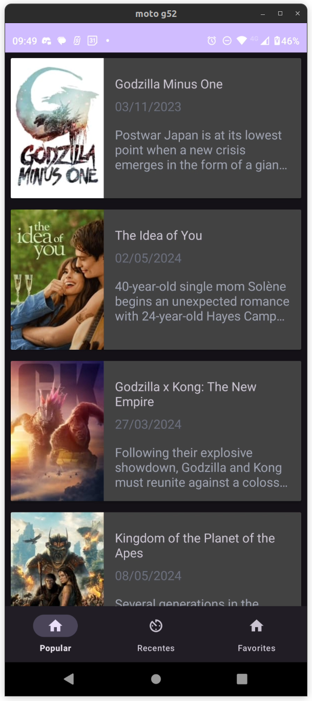
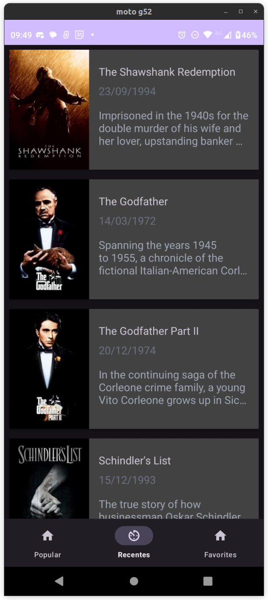

<h1 align="center">Backfront Movies</h1>

  Aplicativo sendo desenvolvido durante o módulo de arquitetura do curso Backfront Plus.

---

 

  <a href="#demonstracao">Demonstração</a> •
  <a href="#features">Features</a> •
  <a href="#tecnologias">Tecnologias</a> •
  <a href="#autor">Autor</a>

---

<h2 id="demonstracao">📽️ Demonstração</h2>

  
  
  

---

<h2 id="features">🚀 Features</h2>

- [x] Listagem de filmes por popularidade e por data de lançamento;
- [x] Favoritar filmes;
- [x] Remover filmes favoritados;
- [x] Salvar dados em um banco de dados local;
- [x] Requisição a API externa;
- [x] Arquitetura MVVM;
- [x] Injeção de Dependências.

---

<h2 id="tecnologias"> 🤖 Tecnologias</h2>
As seguintes tecnologias foram usadas nesse projeto:

<ul>
  <li><a href="https://developer.android.com/studio">Android Studio</a></li>
  <li><a href="https://kotlinlang.org/">Kotlin</a></li>
  <li><a href="https://developer.android.com/kotlin/parcelize?hl=pt-br">Parcelize</a></li>
  <li><a href="https://bumptech.github.io/glide/">Glide</a></li>
  <li><a href="https://square.github.io/retrofit/">Retrofit</a></li>
  <li><a href="https://github.com/google/gson">Gson</a></li>
  <li><a href="https://developer.android.com/training/data-storage/room?hl=pt-br">Room</a></li>
  <li><a href="https://insert-koin.io/">Koin</a></li>
</ul>

---

<h2 id="autor">👨 Autor</h2>

<a href="https://github.com/EnriqueIzel2">
 
  
 <b>Enrique Izel</b>
</a>
  

